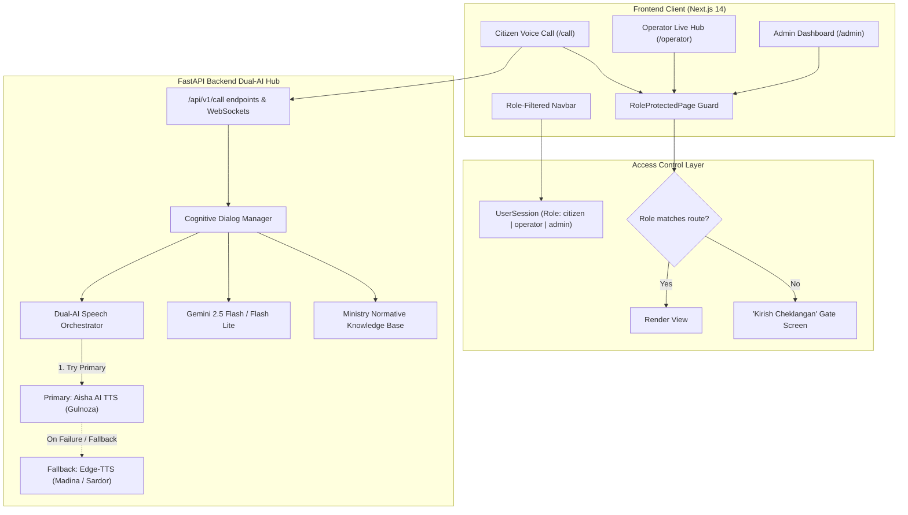

# Implementation Plan: Aisha AI Prioritization, Role-Based Page Restrictions & Copy Streamlining

## Executive Summary
This plan addresses the three core requirements specified for **SözLab (Oliy ta'lim, fan va innovatsiyalar vazirligi ovozli call-markazi)**:
1. **Dual-AI Architecture (Aisha AI Primary)**: Integrate **Aisha AI API** (`https://back.aisha.group`) using the provided key (`vlk_Iyeis6LM8pFCI0aMVTbeXUeJqpL_3GMhgAXmMLMAwpI`) as the prioritized primary engine for Uzbek speech synthesis (TTS with `Gulnoza` voice model) and speech-to-text (STT), while seamlessly orchestrating Google Gemini 2.5 and Edge-TTS as the high-intelligence dialog and resilient fallback engine.
2. **Strict Role-Based Page Restrictions**: Enforce client and route-level protection so that users in one role (e.g. Citizen) cannot access or view portals intended for other roles (Operator `/operator`, Admin `/admin`, Analytics `/analytics`), paired with dynamic role-filtered navigation.
3. **Copy Streamlining (Make Website Less Wordy)**: Refactor verbose, bureaucratic paragraphs and hackathon fluff across all frontend pages into punchy, high-impact, modern enterprise UI copy.

---

## Architecture & Data Flow

---

## Detailed Task Breakdown

### Component 1: Dual-AI Engine with Aisha AI Prioritization
- **Target Files**:
  - `backend/app/core/config.py`: Add `AISHA_API_KEY`, `AISHA_BASE_URL`, `PRIMARY_TTS_ENGINE`, `PRIMARY_STT_ENGINE`.
  - `backend/.env`: Persist `AISHA_API_KEY=vlk_Iyeis6LM8pFCI0aMVTbeXUeJqpL_3GMhgAXmMLMAwpI`, `AISHA_BASE_URL=https://back.aisha.group`.
  - `backend/app/services/aisha_service.py` *(New)*:
    - `synthesize_speech(text, model="Gulnoza", mood="Neutral", speed=1.0)`: Calls `POST /api/v1/tts/post/` with `X-Api-Key` header, caches downloaded audio locally, returns audio path.
    - `transcribe_audio(file_bytes, filename)`: Calls `POST /api/v1/stt/post/` with `X-Api-Key`.
    - Resilient circuit breaker: catches timeouts, format errors, or HTTP failures and delegates cleanly to the fallback engine.
  - `backend/app/services/tts_service.py`:
    - Update `generate_speech` to check Aisha AI first if enabled.
    - If Aisha succeeds, return Aisha audio URL.
    - If Aisha encounters any network or format error, seamlessly fall back to Edge-TTS (`uz-UZ-MadinaNeural`) without dropping speech or delaying the call.
  - `backend/tests/test_aisha_service.py` *(New)*: Unit test verifying Aisha integration, caching, and fallback behavior.

### Component 2: Role-Based Page Restrictions & Route Protection
- **Target Files**:
  - `frontend/components/RoleProtectedPage.tsx` *(New)*:
    - Reusable route guard component taking `allowedRoles: UserRole[]` and `fallbackUrl?: string`.
    - Checks `session.role` and `isReady` from `useRole()`.
    - If unauthorized, renders an elegant, secure **"Ruxsat etilmagan / Kirish Cheklangan"** view with:
      - Shield lock icon and clear notice (e.g., *"Ushbu sahifa faqat Operatorlar uchun mo'ljallangan"*).
      - Action button: *"O'z kabinetingizga qaytish"* (directing to the user's permissible route).
      - Auto-redirect countdown.
  - `frontend/app/operator/page.tsx`: Wrap in `<RoleProtectedPage allowedRoles={['operator']}>`.
  - `frontend/app/admin/page.tsx`: Wrap in `<RoleProtectedPage allowedRoles={['admin']}>`.
  - `frontend/app/call/page.tsx`: Wrap in `<RoleProtectedPage allowedRoles={['citizen']}>`.
  - `frontend/app/analytics/page.tsx` & `frontend/app/history/page.tsx`: Wrap in `<RoleProtectedPage allowedRoles={['admin', 'operator']}>`.
  - `frontend/components/Navbar.tsx`:
    - Filter navigation links dynamically according to `session.role`:
      - **Citizen**: Sees only `Bosh Sahifa` (`/`) and `Ovozli Qo'ng'iroq` (`/call`). Operator and Admin routes are hidden.
      - **Operator**: Sees only `Operator Paneli` (`/operator`) and `Tarix` (`/history`).
      - **Admin**: Sees `Admin Boshqaruvi` (`/admin`), `Analitika` (`/analytics`), `Tarix` (`/history`).
    - Make role switching intentional and protected.

### Component 3: Copy Streamlining (Make Website Less Wordy)
- **Target Files**:
  - `frontend/app/page.tsx`:
    - Replace bulky paragraphs and hackathon notices with concise, enterprise-grade typography.
    - Hero: *"SözLab — Oliy Ta'lim Ovozli Call-Markazi"*
    - Subtitle: *"Qabul, grantlar va talabalar masalalari bo'yicha 24/7 sun'iy intellektli ovozli maslahatchi."*
    - Three crisp benefit cards: *Tabiiy O'zbek Tili*, *Rasmiy Vazirlik Bazasi*, *Jonli Operator Navbati*.
  - `frontend/components/CallSimulator.tsx`:
    - Trim long instructional banners. Replace with minimalist status badges (`Tayyor`, `AI Gapirmoqda`, `Operator Navbatida`, `Jonli Efir`).
  - `frontend/components/OperatorQueue.tsx` & `OperatorLiveCall.tsx`:
    - Compact call badges, concise buttons (`Qabul qilish`, `Tugatish`), clean captions area without repetitive paragraphs.
  - `frontend/app/admin/page.tsx`:
    - Streamline KPI labels, remove redundant descriptions from analytics cards and teleprompter headers.

---

## Verification & Acceptance Criteria
1. **Automated Backend Tests**:
   - `python -m pytest backend/tests/ -v` passes 100% (all existing tests + new Aisha/Dual-AI tests).
2. **Frontend Type & Build Check**:
   - `npm run build` exits with code 0 without any TypeScript or Next.js build errors.
3. **Role Gating Verification**:
   - Direct navigation as Citizen to `/operator` or `/admin` displays the Access Restricted screen and blocks view.
   - Navbar displays strictly role-authorized links.
4. **Dual-AI Speech Verification**:
   - Call audio synthesizes smoothly; fallback to Edge-TTS activates seamlessly if external API quota or format errors arise.
5. **Copy Quality Verification**:
   - Pages are clean, uncluttered, and free of unnecessary bureaucratic verbosity.
