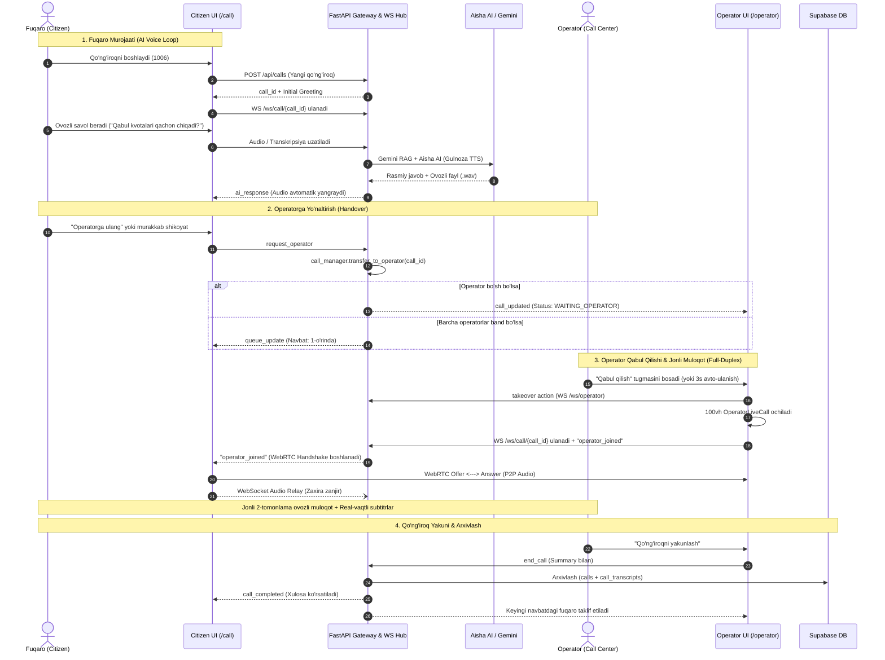

# Implementation Plan: Production-Ready Live Audio Call, Modern Voice UX & Dynamic Zero-Mock Architecture

## 1. Goal Description
The purpose of this milestone is to elevate **SözLab (Oliy ta'lim, fan va innovatsiyalar vazirligi ovozli call-markazi)** into a battle-tested, production-ready platform by addressing five core objectives:
1. **Fix Operator-Citizen Live Call**: Diagnose and eliminate the root causes preventing full-duplex WebRTC and WebSocket audio streaming between the citizen and the operator.
2. **Best-in-Class Voice AI UX**: Implement modern voice agent design patterns (inspired by LiveKit Voice Agents, ElevenLabs ConvAI, and Vapi) including multi-stage Voice Orb animation, Web Audio API procedural sound chimes (ring, connect, transfer, hangup), sub-second interruption handling (barge-in), and live connection telemetry.
3. **Dynamic Operator Fleet (Remove 3-Operator Limit)**: Transition from a static 3-operator array to dynamic N-operator onboarding with custom names, departments, and real-time status tracking (`AVAILABLE`, `BUSY`, `OFFLINE`).
4. **Zero-Mock Production Data**: Clean out hardcoded mock queue items (`call-101` to `call-105`), load real history from Supabase, and ensure all stats, queues, and analytics represent live state.
5. **End-to-End Workflow Architecture**: Provide an exhaustive, transparent explanation of how the system functions across citizen, AI voice assistant, live human operator, and supervisory admin roles.

---

## 2. Root Cause Analysis: Why Operator Live Call Failed

Our codebase investigation revealed three distinct architectural bugs that prevented the live call from working:

```
[BUG 1: WebSocket Signaling Asymmetry]
OperatorLiveCall connects to /ws/call/{call_id} and sends {"type": "operator_joined"}
  └── ws.py had NO handler for msg_type == "operator_joined" in /ws/call/{call_id}!
      └── Citizen socket was NEVER notified that the operator arrived on the call socket!

[BUG 2: WebRTC Offer/Answer Race Condition]
Operator created SDP Offer after a hardcoded 600ms setTimeout.
  └── Citizen was still awaiting navigator.mediaDevices.getUserMedia() (takes 700ms - 1500ms).
      └── Citizen's webrtcRef.current was null when SDP Offer arrived -> Offer dropped with NO retry!

[BUG 3: WebSocket Fallback Audio Playback Failure]
MediaRecorder.start(400) creates WebM chunks streamed as peer_audio_chunk.
  └── Browser WebM only contains the EBML header on chunk #0!
      └── Chunks #1..N cannot be decoded with `new Audio(blobUrl)` -> resulted in silent or failing fallback!

[BUG 4: Autoplay Policy on Detached Audio Element]
`new Audio()` was created detached from the DOM, causing Chrome/Edge to silently suspend audio playback.
```

---

## 3. End-to-End Workflow Architecture



---

## 4. User Review Required

> [!IMPORTANT]
> **1. WebRTC & WebSocket Handshake Protocol**:
> We are introducing an explicit bidirectional handshake (`peer_ready` -> `webrtc_offer` -> `webrtc_answer` -> `connected`). If WebRTC P2P fails due to strict NAT/firewalls, audio automatically streams through the WebSocket Audio Relay with an AudioBuffer queue.
>
> **2. Removing Mock Data**:
> Static calls (`call-101` to `call-105`) will be completely cleared from the active queue. The queue will represent 100% real calls. Historical logs will load from Supabase or start clean.
>
> **3. Dynamic Operator Login**:
> The 3-person dropdown in `RoleGateModal.tsx` will be replaced with an open operator onboarding form where any operator can enter their real name and department.

---

## 5. Proposed Changes Grouped by Component

### Component A: Live Audio Call Engine & Signaling Handshake
#### [MODIFY] `backend/app/api/routes/ws.py`
- Add explicit handlers in `/ws/call/{call_id}` for:
  - `operator_joined`: Broadcasts to all call sockets that the operator has joined and is ready for audio negotiation.
  - `peer_ready`: Coordinates when both citizen and operator have mic streams active before initiating SDP offer.
  - `webrtc_offer`, `webrtc_answer`, `webrtc_ice_candidate`: Enhanced validation and broadcasting.
  - `peer_audio_chunk`: Relays real-time audio chunks with sequence IDs and timestamps.

#### [MODIFY] `frontend/lib/webrtcManager.ts`
- Implement robust state machine:
  - Queue signaling messages arriving before `pc` is initialized.
  - Add explicit `peer_ready` handshake.
  - Auto-renegotiate if ICE connection fails.
  - Fix WebSocket Audio Relay playback: replace naive `new Audio(blobUrl)` with Web Audio API `AudioContext.decodeAudioData` / `AudioBufferSourceNode` queue for smooth, seamless audio chunk playback without WebM header issues.
  - Attach remote audio directly to a DOM-rendered `<audio>` element ref.

#### [MODIFY] `frontend/components/CallSimulator.tsx` & `frontend/components/OperatorLiveCall.tsx`
- Add dedicated `<audio ref={remoteAudioRef} autoPlay playsInline className="hidden" />` mounted directly in the JSX DOM.
- Bind WebRTC remote stream to the DOM audio element to bypass browser autoplay blocks.
- Real-time connection badge: `P2P WebRTC Bog'landi` | `Audio Relay Faol` | `Ulanmoqda...`.

---

### Component B: Voice UX Excellence (Modern Voice AI Design Patterns)
#### [NEW] `frontend/lib/soundEffects.ts`
- Procedural, zero-dependency Web Audio API sound generator:
  - `playChimeConnect()`: Gentle ascending double-tone (880Hz -> 1320Hz) on call connect.
  - `playRingTone()`: Subtle periodic telephone pulse during operator transfer.
  - `playOperatorJoined()`: Crisp pleasant notification chime.
  - `playChimeHangup()`: Soft descending tone (880Hz -> 440Hz) on call termination.
  - `playMuteToggle(muted)`: Subtle tactile click.

#### [MODIFY] `frontend/components/CallSimulator.tsx`
- **Dynamic Multi-Ring Voice Orb**:
  - Idle: Gentle breathing ambient glow.
  - Listening: Responsive emerald ripple expanding with mic input level.
  - Thinking: Smooth rotating cyan orbit animation.
  - Speaking: Energetic acoustic waveform pulse.
  - Live Call: Dual-waveform visualizer (Citizen Green vs Operator Blue).
- **Interruption / Barge-in**: If citizen speaks while AI response is playing, instantly mute/stop AI playback and transition to listening state.
- **Connection Health & Telemetry**: Ping latency indicator (`Kechikish: ~80ms | Sifat: A'lo`).

---

### Component C: Dynamic Operator Fleet & Zero-Mock Architecture
#### [MODIFY] `frontend/components/RoleGateModal.tsx`
- Remove hardcoded `OPERATORS_LIST` (Nargiza, Bekzod, Dilnoza).
- Provide a clean dynamic operator entry interface:
  - Operator Ism-Familiyasi (input text, e.g. `Rustam Karimov`).
  - Bo'lim / Yo'nalish (Select or custom text: `Qabul va kvotalar`, `Kontrakt va to'lovlar`, `Yotoqxona (TTJ)`, `Nostrifikatsiya`, `Umumiy maslahat`).
  - Remembers last used operator profile in `localStorage` for 1-click re-entry.
- Dynamic operator registration on the backend (`call_manager.register_operator(...)`).

#### [MODIFY] `backend/app/services/call_manager.py`
- Remove all dummy active queue calls (`call-102`, `call-104`). The live waiting queue starts 100% clean.
- Keep historical sample records isolated to past completed calls ONLY if database is unseeded, or query live from Supabase.
- Support dynamic N-operator fleet with heartbeat tracking.

#### [MODIFY] `backend/app/services/supabase_service.py`
- Add `get_archived_calls(limit=50)` and `get_registered_operators()` to fetch real production data directly from Supabase PostgreSQL.

---

## 6. Verification Plan

### Automated Tests
1. **Pytest Backend Suite**:
   ```bash
   python -m pytest backend/tests/ -v
   ```
   - All 84+ tests must pass 100% green.
   - Add new tests for dynamic operator registration, `operator_joined` WS signaling, and clean queue initialization.

2. **Frontend Type & Production Build**:
   ```bash
   cd frontend && npm run build
   ```
   - 0 TypeScript errors, 0 ESLint warnings, 9/9 routes compiled cleanly.

3. **Role Matrix Verification**:
   ```bash
   node frontend/scripts/test-adversarial-roles.mjs
   ```
   - All 15 access control routes verified.

### Manual Verification Flow
1. **Citizen -> Operator Live Call Test**:
   - Open Browser 1 (Citizen): Go to `/call`, start call, ask "Operator bilan gaplashmoqchiman".
   - Status transitions to `waiting_operator` with queue position #1.
   - Open Browser 2 (Operator): Enter name "Sardor Yo'ldoshev (Operator)", go to `/operator`.
   - Inbound call appears in queue. Click "Qabul qilish".
   - Both screens transition to Live Audio Call.
   - Speak in Browser 1: Browser 2 receives audio, Voice Orb pulses, subtitle shows `Fuqaro: ...`.
   - Speak in Browser 2: Browser 1 receives audio, subtitle shows `Operator: ...`.
   - Click "Qo'ng'iroqni yakunlash": Chime plays, summary displays, call archives cleanly to Supabase.
