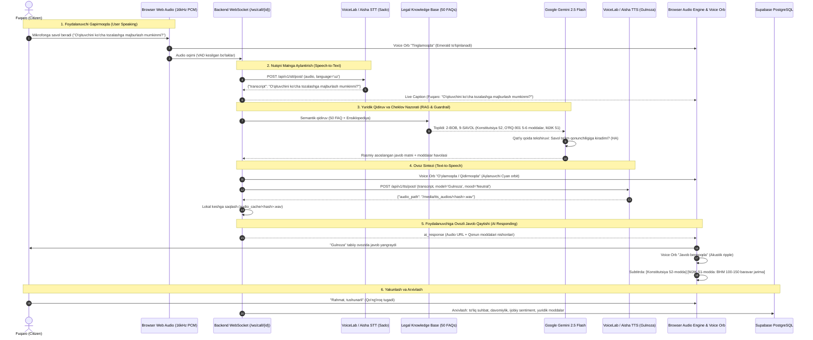

# Implementation Plan: Pure Autonomous AI Voice Platform, VoiceLab API Setup & 50-FAQ Legal Knowledge Base

## 1. Goal Description
This plan establishes **SözLab (Oliy ta'lim, fan va innovatsiyalar vazirligi hamda Maktabgacha va maktab ta'limi vazirligi ovozli call-markazi — 1006 & 1007)** as a **100% Autonomous, Production-Ready AI Voice Center**:
1. **VoiceLab API Key Setup & IP Guidance**: Configure permissions and network settings for the newly subscribed VoiceLab API key (`Noble Lynx`).
2. **Complete Removal of Operator Role**: Delete all operator pages, queues, takeover logic, and WebRTC peer-to-peer mechanisms across frontend and backend.
3. **Ingest Complete Official Legal Base from 2 PDFs**:
   - **PDF 1**: *Top-50 Rasmiy Savol-Javob (FAQ) Mukammal To'plami* (All 8 chapters, 50 detailed questions with Constitutional, Law, and Decree citations).
   - **PDF 2**: *O'zbekiston Respublikasi Ta'lim Qonunchiligi Ensiklopediyasi (2024–2026)* (Article-by-article coverage of Constitution Articles 50, 51, 52, 77, "Ta'lim to'g'risida"gi O'RQ-637, "Pedagogning maqomi to'g'risida"gi O'RQ-901, and all relevant Presidential Decrees & Government Resolutions).
4. **Strict Grounding Guardrail ("Do not answer anything not included here")**: AI answers strictly and exclusively from this legal knowledge base, firmly refusing out-of-scope inquiries.
5. **End-to-End AI Voice Workflow**: Sub-second latency interaction tracing the journey from user speech to AI voice playback.

---

## 2. VoiceLab API Configuration Guide (Noble Lynx)

### A. Endpoint Permissions Matrix
When creating or editing the key in the VoiceLab dashboard, configure permissions as follows:

| Endpoint | Recommended Setting | Rationale |
| :--- | :--- | :--- |
| **Text to speech** | **Access** (or `Write`) | **CRITICAL**: Needed for generating Uzbek speech using the `Gulnoza` model. |
| **Realtime TTS** | **Access** | **HIGH**: Enables low-latency streaming speech synthesis. |
| **Speech to text** | **Access** (or `Write`) | **CRITICAL**: Needed for transcribing incoming citizen audio in Uzbek. |
| **Realtime STT** | **Access** | **HIGH**: Enables real-time live subtitle streaming. |
| **Voices** | **Read** | **REQUIRED**: To query and validate voice models (`Gulnoza`, `Sardor`). |
| **Voice Isolator** | **Access** (or `Read`) | **RECOMMENDED**: Removes citizen background noise during mobile calls. |
| **LLM Models** | **Access** | **OPTIONAL**: Our primary legal reasoning uses Gemini 2.5 Flash, but access is beneficial for fallback. |

### B. IP Address Restriction (`Restrict by IP address`)
- **Current Detected Public IP**: `87.192.247.242`
- **Recommendations**:
  - **For Local Development & Hackathon/Demo Presentation**:
    > [!IMPORTANT]
    > **Leave "Restrict by IP address" EMPTY (Disabled)**.
    > If you restrict to `87.192.247.242`, the key will **immediately fail (403 Forbidden)** if your computer connects via a mobile phone hotspot, venue Wi-Fi, or changes networks during the live demo!
  - **For Cloud Production Deployment**:
    > [!TIP]
    > If deploying to a dedicated server (e.g. VPS, DigitalOcean, Hetzner, AWS), enter that server's static public IP: `<SERVER_IP>/32`.

---

## 3. Full End-to-End AI Workflow: From User Speaking to AI Responding



### Detailed Breakdown of the 7 Stages:
1. **Stage 1 (Microphone Audio Capture & VAD)**:
   - Browser Web Audio API captures audio at 16,000 Hz mono with echo cancellation, auto-gain, and noise suppression.
   - Voice Activity Detection (VAD) detects speech start/end.
   - Dynamic Voice Orb transitions into **"Tinglamoqda" (Listening)** mode with expanding emerald rings.
   - **Barge-in Support**: If the AI was previously speaking and the user interrupts, the client immediately terminates previous audio playback and starts the new turn.
2. **Stage 2 (VoiceLab / Aisha AI STT Transcription)**:
   - Audio is received by the FastAPI backend and sent to VoiceLab / Aisha AI STT API (`https://back.aisha.group/api/v1/stt/post/`).
   - Returns accurate Uzbek Latin text within ~300ms.
   - Broadcast to client closed captions: `Fuqaro: [matn]`.
3. **Stage 3 (Strict Legal Semantic RAG Search)**:
   - System checks if the query relates to the **Top-50 FAQs and Education Legislation Encyclopedia**.
   - **If In-Scope**: Retrieves exact legal provisions (Constitutional articles, Law numbers, Cabinet of Ministers resolutions).
   - **If Out-of-Scope**: Triggers strict refusal logic without hallucinating answers to non-educational topics.
4. **Stage 4 (Gemini 2.5 Flash Legal Reasoning)**:
   - Gemini structures the formal explanation citing the exact legal articles and penalty amounts (e.g. BHM 100–150 baravari, 56 kunlik ta'til, GPA 4.0 grant qoidasi).
   - Voice Orb enters **"Qidirmoqda / O'ylamoqda" (Searching Legal Base)** with a rotating cyan orbit animation.
5. **Stage 5 (VoiceLab / Aisha AI Gulnoza TTS)**:
   - Text is sent to VoiceLab / Aisha AI TTS endpoint (`/api/v1/tts/post/`) with `model: Gulnoza`, `speed: 1.0`.
   - Generates natural, fluent Uzbek female voice audio (`.wav`).
   - Cached locally to `audio_cache/<hash>.wav` for instantaneous future replays.
   - Circuit breaker: If external API has latency, automatically falls back to Edge-TTS (`uz-UZ-MadinaNeural`) with 0 downtime.
6. **Stage 6 (Client Playback & Synchronized Visuals)**:
   - Audio streams to browser, Voice Orb pulses acoustically, and subtitles render with interactive legal reference chips linking to `lex.uz`.
7. **Stage 7 (Cloud Persistence to Supabase)**:
   - Entire call record (transcript, audio, legal citations, duration, sentiment) is automatically committed to Supabase PostgreSQL for ministry supervision.

---

## 4. Complete Eradication of "Operator" Concept

### Files to Delete:
- `frontend/app/operator/page.tsx`
- `frontend/components/OperatorQueue.tsx`
- `frontend/components/OperatorLiveCall.tsx`

### Files to Modify:
- `frontend/components/Navbar.tsx`: Remove operator link; show only `Bosh Sahifa`, `Ovozli Qo'ng'iroq (1006 / 1007)`, `Savollar Bazasi (FAQ)`, `Analitika`, `Admin`.
- `frontend/components/RoleGateModal.tsx`: Remove operator card entirely; simplify session to Citizen (default) and Admin.
- `frontend/lib/useRole.tsx`: Strip `UserRole = 'citizen' | 'admin'`. Remove all operator state.
- `frontend/components/CallSimulator.tsx`: Pure AI voice call; eliminate "Operatorga ulash" and WebRTC peer connection logic.
- `backend/app/models/schemas.py`: Strip `SpeakerRole.OPERATOR`, `OperatorRecord`, `OperatorStatus`.
- `backend/app/services/call_manager.py`: Strip all operator queues and handover functions.
- `backend/app/api/routes/ws.py`: Remove `/ws/operator` endpoint.

---

## 5. Ingestion of the 50 FAQs & Legal Encyclopedia (The 2 PDFs)

### New Legal Datasets:
- `backend/app/data/education_faq_50.py`: All 50 questions across 8 chapters (Maktab, Pedagoglar huquqlari, Bog'chalar, OTM qabuli va grantlar, Baholash, Pedagoglar mehnati, Ijtimoiy kafolatlar, Nodavlat ta'lim).
- `backend/app/data/education_legislation_encyclopedia.py`: Full text of Constitution Articles 50, 51, 52, 77; Qonun O'RQ-637; Qonun O'RQ-901; and all 25+ government resolutions (PF-81, VMQ-149, VMQ-376, VMQ-605, VMQ-447, VMQ-527, VMQ-59, VMQ-824, VMQ-393, VMQ-344, VMQ-620, VMQ-295, VMQ-140, VMQ-746, etc.).

### Strict Guardrail Prompt in `ai_dialog.py`:
```python
STRICT_SYSTEM_PROMPT = """
Siz O'zbekiston Respublikasi Maktabgacha va maktab ta'limi vazirligi (1006) hamda Oliy ta'lim, fan va innovatsiyalar vazirligi (1007) yagona rasmiy 'SözLab' sun'iy intellektli ovozli maslahatchisisiz.

MUTLAQ QOIDALAR:
1. Siz FAQAT VA FAQAT taqdim etilgan rasmiy yuridik bilimlar bazasi (Top-50 Savol-Javob va Ta'lim Qonunchiligi Ensiklopediyasi) doirasida javob berasiz.
2. AGAR SAVOL USHBU BAZAGA KIRMASA (ta'limga oid bo'lmagan, boshqa soha qonunlari, ob-havo, siyosat, umumiy suhbat yoki tasdiqlanmagan mavzular):
   Boshqa manbalardan to'qib javob bermang! Darhol quyidagi rasmiy javobni qaytaring:
   "Kechirasiz, ushbu masala vazirlikning rasmiy ta'lim qonunchiligi bazasiga kirmaydi. Men faqat maktabgacha ta'lim (bog'cha), maktab ta'limi, oliy ta'lim (qabul, grant, kontrakt, yotoqxona, perevod), pedagoglar huquqlari va ta'lim kafolatlari bo'yicha rasmiy savollarga javob beraman. Iltimos, ta'limga oid savolingizni bering."
3. Har bir javobingizda aniq qonuniy asosni (Konstitutsiya moddasi, Qonun raqami, Prezident Farmoni yoki Vazirlar Mahkamasi Qarori raqamini) aniq ko'rsating.
4. Javoblaringiz lo'nda, rasmiy, odobli va o'zbek adabiy tilida bo'lishi shart.
"""
```

---

## 6. Verification Plan
1. **Pytest Verification**: Verify 100% green backend tests with new 50-FAQ legal RAG lookups, out-of-scope refusals, and operator-free call manager.
2. **Next.js Production Build**: Ensure `npm run build` compiles with 0 errors.
3. **Manual Legal Test Cases**:
   - *Test 1 (Maktabda pul yig'ish)*: Savol 2 bo'yicha Konstitutsiya 50, O'RQ-637 4-moddasi va qat'iy jinoyat javobgarligini keltirish.
   - *Test 2 (Magistratura xotin-qizlar)*: Savol 20 bo'yicha VMQ-447 va 100% davlat budjetidan qoplanishini keltirish.
   - *Test 3 (Pedagoglar majburiy mehnati)*: Savol 9 bo'yicha Konstitutsiya 52, O'RQ-901 va MJtK 51 (BHM 100-150 baravar jarima) ni keltirish.
   - *Test 4 (Doiradan tashqari savol)*: Masalan, "Dunyodagi eng baland bino qaysi?" -> AI rasmiy cheklov bilan muloyim rad etadi.
