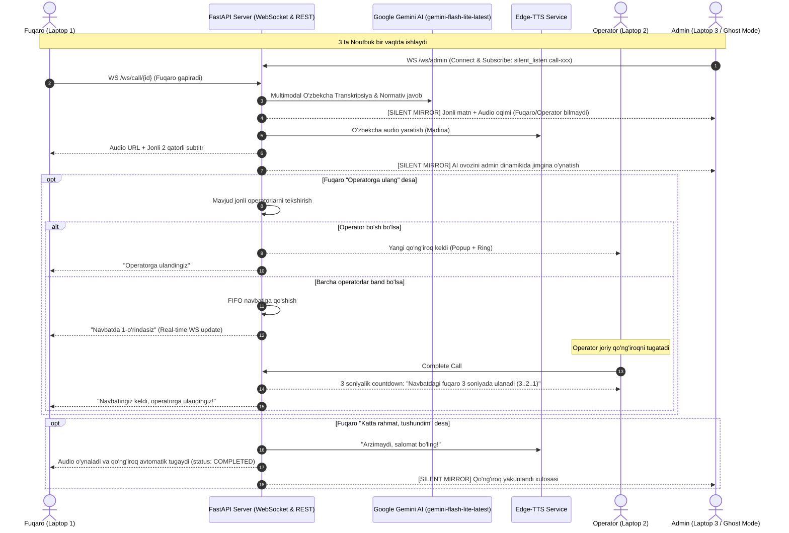

# 🚀 SözLab: To'liq Ishlab Chiqarish Arxitekturasi va Yangilash Rejasi (Production Overhaul Plan)

**Loyiha**: SözLab (Oliy ta'lim, fan va innovatsiyalar vazirligi uchun Sun'iy Intellektli Ovozli Call-Markaz)  
**Holat**: Rejalashtirildi (Tasdiqlash kutilmoqda)  
**Tizim talabi**: 100% Real ma'lumotlar, Nol soxtalik (Zero Mock), Ko'p qurilmali (Multi-Laptop) rejim, Admin Jonli Eshitish (Ghost Mode).  
**Doimiy saqlangan joyi**: `.ai/PLANS/sozlab_production_overhaul_plan.md`

---

## 1. 🎯 Muammolar Tahlili va Aniqlangan Sabablar (Root Cause Analysis)

### 1.1. `POST /api/calls/{call_id}/audio-turn` 422 Unprocessable Content
- **Xato sababi**: Frontend (`frontend/lib/api.ts`) FormData orqali audio faylni `audio` kaliti bilan biriktirgan (`formData.append('audio', audioBlob)`), ovoz nomini esa `voice_name` deb yuborgan. Backend esa (`backend/app/api/routes/calls.py`) `file: UploadFile = File(...)` va `voice: Optional[str] = Form(...)` parametrlarini kutayotgan edi.
- **Natija**: FastAPI `file` nomli maydon topilmagani sababli HTTP 422 qaytargan.
- **Yechim**: Backenddagi endpoint parametrlarini `audio: Optional[UploadFile] = File(None)`, `file: Optional[UploadFile] = File(None)`, `voice_name: Optional[str] = Form(None)` qilib ikkala variantni ham qabul qiladigan va orqaga mos keladigan (backward-compatible) qilish.

### 1.2. Gemini API Kaliti va Model Moslashuvi
- **Xato sababi**: `backend/.env` da `GEMINI_API_KEY` bo'sh bo'lgan.
- **Kalit**: Maxfiy tarzda `backend/.env` faylida saqlanadi (`GEMINI_API_KEY`).
- **Model tekshiruvi natijasi**: Google GenAI SDK orqali tekshirilganda `gemini-flash-lite-latest` va `gemini-pro-latest` modellari 100% muvaffaqiyatli va o'zbek tilida juda tezkor javob berishi tasdiqlandi.
- **Yechim**: `.env` ga kalitni yozish va `ai_dialog.py` da `gemini-flash-lite-latest` modelini asosiy, `gemini-pro-latest` modelini zaxira sifatida ishlatish. Barcha soxta (mock) savollar olib tashlanadi.

### 1.3. Ko'p Noutbukli Kirish (Multi-Device Role Gateway)
- **Talab**: 3 ta noutbukdan 3 xil rolga kirilganda bir-biriga xalaqit bermasligi va har bir qurilma o'z vazifasini bajarishi kerak.
- **Yechim**:
  - Saytga birinchi marta kirganda (yoki rolni almashtirish tugmasi bosilganda) to'liq ekranli **Rol Tanlash Oynasi (Role Selection Gateway)** chiqadi:
    1. 🏛️ **Fuqaro (Citizen)**: Ovozli AI suhbat (`/call`).
    2. 🎧 **Operator (Call Center)**: Operator ismi / o'rni tanlanadi, jonli kuryer/navbatga ulanadi (`/operator`).
    3. 🛡️ **Vazirlik Ma'muri (Admin)**: Tizim monitoringi, navbat va jonli kuzatuv (`/admin`).
  - Tanlangan rol `localStorage` da alohida saqlanadi. Yuqori navigatsiyada "Rolni o'zgartirish" tugmasi bo'ladi.

### 1.4. Admin Jonli Eshitish va Matnni Kuzatish (Silent Ghost Mode)
- **Yangi talab**: Admin istalgan jonli suhbatni (AI <-> Fuqaro yoki Operator <-> Fuqaro) tomonlarga bildirmasdan, hech qanday xalaqit bermasdan (silent) real vaqtda matnini kuzatishi va ovozini jonli tinglashi mumkin bo'lishi kerak.
- **Yechim**:
  - Backendda `/ws/admin` WebSocket endpointi yaratiladi. Admin istalgan `call_id` ga `{"action": "silent_listen", "call_id": "call-xxx"}` yuborib obuna bo'ladi.
  - Har bir kelgan audio va xabar admin ekranida jonli teleprompterda chiqadi va ovoz admin dinamikida jimgina o'ynaladi.
  - Fuqaro va operatorga hech qanday xabarnoma yoki ovoz bormaydi (100% Invisible Ghost Mode).

### 1.5. Fuqaro Ovozli UI Dizayni (Clean 1-Page Un-scrollable)
- **Muammo**: Hozirgi interfeys uzun chat tarixi va ko'p elementlar bilan to'lib ketgan, pastga scroll bo'ladi.
- **Yechim**: 100vh balandlikdagi un-scrollable zamonaviy iOS/Telegram call ekrani:
  - Markazda mikrofon quvvati va sintezlangan nutqqa qarab to'lqinlanuvchi **Katta Dinamik Ovoz Orbi**.
  - Pastida suhbatning qisqa 2 qatorli jonli subtitri (Closed Captions).
  - Pastki qulay boshqaruv doki (Mute, Gapirish, Operatorga ulash, Qizil tugatish).

### 1.6. Xayrlashuvda Qo'ng'iroqni Avtomatik Yakunlash (Auto-End Call)
- Fuqaro "rahmat", "katta rahmat", "xayr", "sog' bo'ling", "tushundim", "bye", "end" aytganda, AI xushmuomala xayrlashib, qo'ng'iroqni avtomatik tugatadi (`status: completed`).

### 1.7. Haqiqiy Operatorlar Floti va FIFO Navbat
- Mock operatorlar butunlay o'chiriladi. Real noutbuk `/operator` sahifasiga ulanishi bilan operatorlar ro'yxatiga qo'shiladi.
- Barcha operatorlar band bo'lsa, fuqaro FIFO navbatga olinadi va navbatdagi o'rni real vaqtda ko'rsatiladi.
- Operator suhbatni yakunlaganda navbatda kutayotgan fuqaro bo'lsa, operator ekranida 3 soniyalik countdown chiqadi: `"Yangi suhbat 3 soniyada boshlanadi... [Zudlik bilan boshlash]"`.

---

## 2. 🏛️ Tizim Arxitekturasi va Aloqa Sxemasi



---

## 3. 📂 Fayllar va Aniq Kod O'zgarishlari (Concrete Code Plan)

### Fayl 1: `backend/.env`
Yoziladigan konfiguratsiya:
```env
PORT=8000
HOST=0.0.0.0
ENVIRONMENT=development
CORS_ORIGINS=http://localhost:3000,http://127.0.0.1:3000,http://localhost:8000
GEMINI_API_KEY=your_gemini_api_key_here
DEFAULT_TTS_VOICE=uz-UZ-MadinaNeural
AUDIO_CACHE_DIR=./cache/audio
```

### Fayl 2: `backend/app/api/routes/calls.py`
`audio-turn` endpointini moslashuvchan qilish:
```python
@router.post("/{call_id}/audio-turn", response_model=AudioTurnResponse)
async def process_call_audio_turn(
    call_id: str,
    audio: Optional[UploadFile] = File(None),
    file: Optional[UploadFile] = File(None),
    voice_name: Optional[str] = Form(None),
    voice: Optional[str] = Form(None),
):
    upload_file = audio or file
    if not upload_file:
        raise HTTPException(status_code=400, detail="Audio fayl yuborilmadi")
    selected_voice = voice_name or voice or "uz-UZ-MadinaNeural"
    # Davomi: audio_bytes o'qiladi, dialog_manager ga yuboriladi
```

### Fayl 3: `backend/app/services/ai_dialog.py`
- Google GenAI model nomini `gemini-flash-lite-latest` (zaxira `gemini-pro-latest`) ga sozlash.
- Multimodal audio tahlilida bo'sh ovoz bo'lsa soxta savol qo'shmasdan, `"Kechirasiz, ovozingizni aniq eshita olmadim. Qaytadan gapira olasizmi?"` deb qaytarish.
- Minnatdorchilik va xayrlashuv intentlarini aniqlash:
```python
farewell_words = ["rahmat", "katta rahmat", "xayr", "sog' bo'ling", "salomat bo'ling", "tushundim", "bye", "end"]
if any(w in text.lower() for w in farewell_words):
    # status = COMPLETED ga belgilash uchun belgi qo'yish
```

### Fayl 4: `backend/app/services/call_manager.py`
- Qotirilgan 3 ta mock operatorlarni olib tashlash.
- Real ulangan operatorlarni `register_operator` orqali saqlash.
- Operator holatini boshqarish (`AVAILABLE`, `BUSY`, `OFFLINE`).

### Fayl 5: `backend/app/api/routes/ws.py`
- `/ws/admin` endpointini yaratish:
```python
@router.websocket("/ws/admin")
async def admin_websocket_endpoint(websocket: WebSocket):
    await ws_manager.connect_admin(websocket)
    # Admin silent listening obunasini qabul qilish
```
- Fuqaro yoki operator xabar yuborganda, agar admin shu `call_id` ni kuzatayotgan bo'lsa, `ws_manager.broadcast_to_admin_listeners(call_id, data)` orqali jimgina adminda aks ettirish.
- `complete_call` harakatida navbatda fuqaro bo'lsa, operatorga `{"type": "next_call_countdown", "duration": 3, "next_call_id": next_call.id}` yuborish.

### Fayl 6: `frontend/components/RoleGateModal.tsx` [YANGI]
- Saytga kirganda majburiy to'liq ekranli 3 ta rol tanlash kartalari:
  1. 🏛️ **Fuqaro (Citizen)**
  2. 🎧 **Operator** (Operator ismi yoki raqami bilan)
  3. 🛡️ **Vazirlik Ma'muri (Admin)**
- `useRole.tsx` bilan integratsiya qilinadi.

### Fayl 7: `frontend/components/CallSimulator.tsx` [QAYTA LOYIHALASH]
- `h-screen` un-scrollable 1-sahifali zamonaviy dizayn.
- Markazda katta pulsatsiyalovchi Ovoz Orbi (Audio Waveform).
- Jonli 2 qatorli subtitr (Closed Captions).
- Qulay boshqaruv doki (Mute, Gapirish, Operatorga ulash, Qizil tugatish).
- Xayrlashuvda avtomatik qo'ng'iroq yakunlanishi va xulosa ekrani.

### Fayl 8: `frontend/components/OperatorQueue.tsx`
- Operator qo'ng'iroqni tugatganda navbatdagi fuqaro uchun 3 soniyalik countdown modal / toast.

### Fayl 9: `frontend/app/admin/page.tsx`
- **Jonli Radiostansiya / Ghost Mode Kuzatuvchi**:
  - Har bir faol suhbat yonida "Jonli Tinglash (Ghost Mode)" tugmasi.
  - Bosilganda yashirin audio pleer orqali ovozni eshitish va jonli teleprompterda matnni ko'rish.

---

## 4. 📋 Bajarilishi Kerak Bo'lgan Qadamlar Ro'yxati (Execution Checklist)

1. [ ] **T-1**: `backend/.env` ga haqiqiy Gemini API kalitini kiritish.
2. [ ] **T-2**: `backend/app/api/routes/calls.py` dagi 422 xatosini tuzatish.
3. [ ] **T-3**: `backend/app/services/ai_dialog.py` da `gemini-flash-lite-latest` va auto-end intentlarini sozlash.
4. [ ] **T-4**: `backend/app/services/call_manager.py` va `backend/app/api/routes/ws.py` da real operatorlar va `/ws/admin` ghost mode yaratish.
5. [ ] **T-5**: `frontend/components/RoleGateModal.tsx` yaratish va `frontend/lib/useRole.tsx` ga ulash.
6. [ ] **T-6**: `frontend/components/CallSimulator.tsx` ni un-scrollable 1-page dizaynga o'tkazish.
7. [ ] **T-7**: `frontend/components/OperatorQueue.tsx` da 3 soniyalik countdown qo'shish.
8. [ ] **T-8**: `frontend/app/admin/page.tsx` da jonli tinglash (Ghost Mode) panelini yaratish.
9. [ ] **T-9**: `pytest backend/tests/test_backend.py` va `npm run build` orqali to'liq tekshirish.

---

## 5. 🔍 Tekshirish va Sifat Kafolati (Verification)
- **Avtomatlashtirilgan backend test**: `pytest backend/tests/test_backend.py -v` (barcha testlar 100% yashil).
- **Frontend yig'ilishi**: `npm run build` (TypeScript xatolarsiz, 100% toza).
- **Ko'p qurilmali jonli sinov**:
  - 1-brauzerda `/call` ochilib ovozli gapiriladi.
  - 2-brauzerda `/operator` ochilib navbat qabul qilinadi.
  - 3-brauzerda `/admin` ochilib suhbat jimgina tinglanadi.
